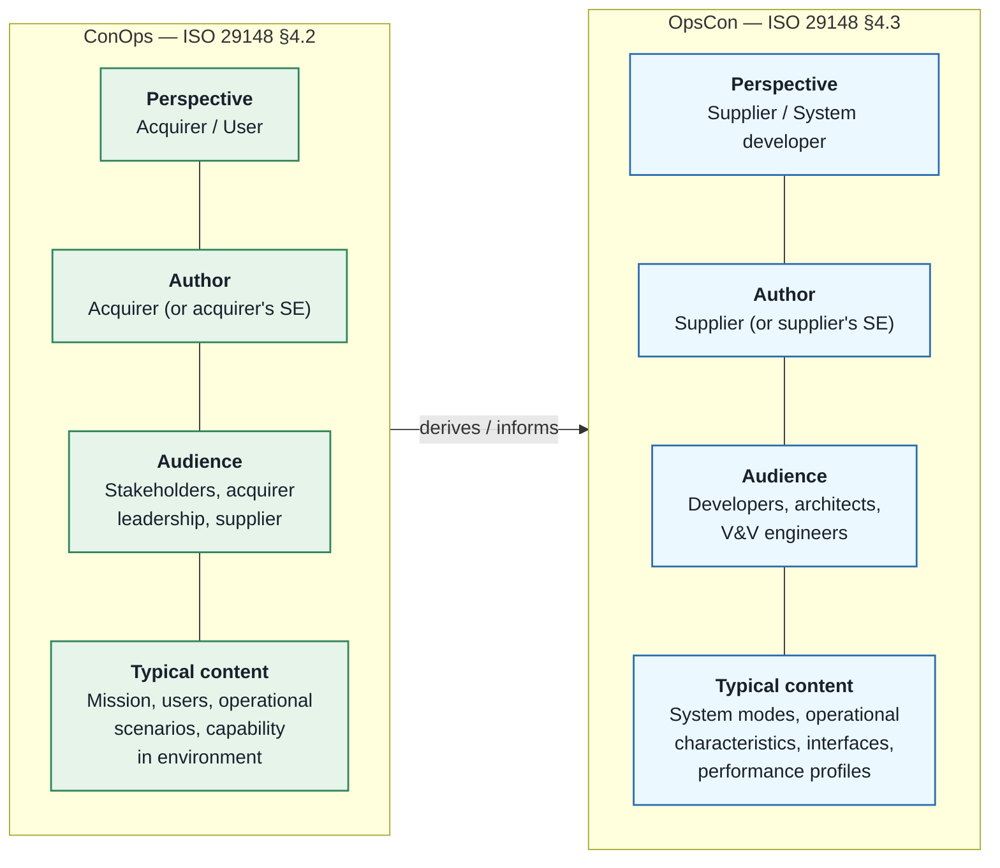
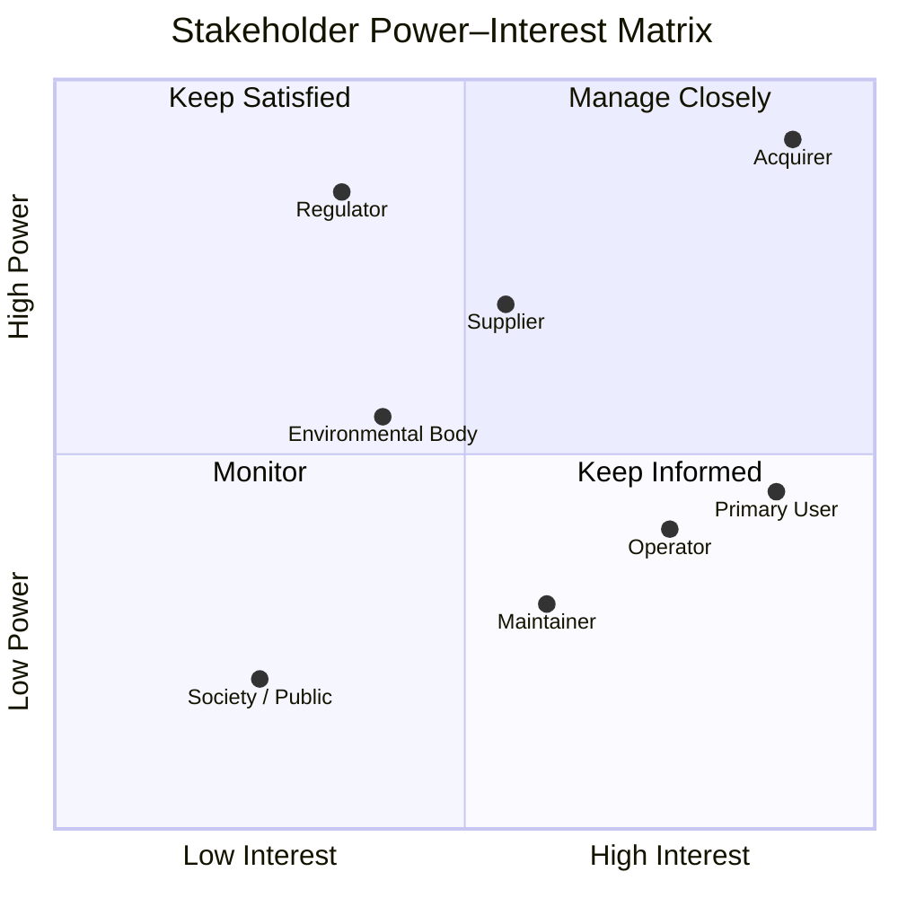
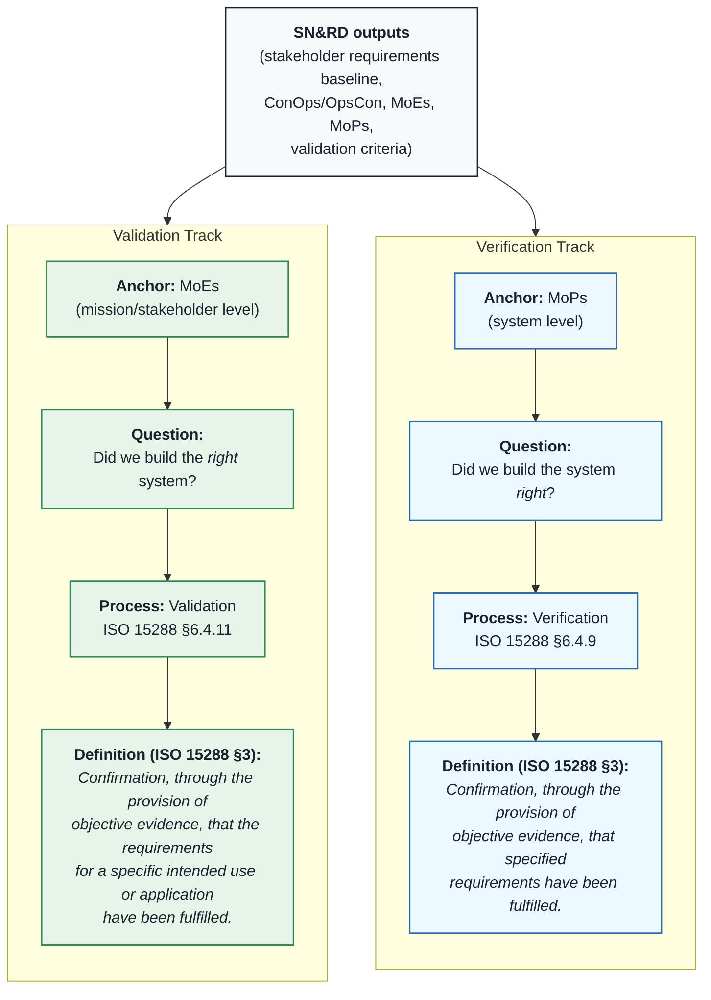

```mermaid
flowchart LR
    A["Enterprise Strategy<br/>Portfolio Decisions<br/>Mission Statements"]
    B["Business or Mission<br/>Analysis (BMA)<br/>ISO 15288 §6.4.1"]
    C["Stakeholder Needs &<br/>Requirements Definition<br/>ISO 15288 §6.4.2"]
    D["System Requirements<br/>Definition<br/>ISO 15288 §6.4.3"]
    E["Architecture<br/>Definition<br/>ISO 15288 §6.4.4"]

    A -->|Strategy, gaps,<br/>regulatory drivers| B
    B -->|Preliminary ConOps,<br/>business requirements,<br/>MoEs, preferred<br/>solution class| C
    C -->|Stakeholder<br/>requirements baseline,<br/>validated ConOps/OpsCon| D
    D -->|System requirements<br/>baseline| E

    classDef process fill:#E8F1FA,stroke:#2B6CB0,stroke-width:1.5px,color:#1A202C
    classDef enterprise fill:#F7FAFC,stroke:#718096,stroke-width:1px,color:#1A202C
    class A enterprise
    class B,C,D,E process
```

# CSEP Week 3 — Illustration Diagram Prompts: Business/Mission Analysis & Stakeholder Needs
**Source Summaries:** `week_03_topic_summaries.md`
**Target Folder:** `Week_03_Diagrams/`
**Chapter/Standards Anchor:** INCOSE SEH5 Chapter 3; ISO/IEC/IEEE 15288:2023 §6.4.1 and §6.4.2; ISO/IEC/IEEE 29148:2018
**Diagrams in this file:** 6 (Summaries 1, 2, 3, 4, 5, 7). Summary 6 is marked "N/A — text only" in the source.

Each entry below is self-contained. Preferred tool: **Mermaid** (renders natively on GitHub and in most Markdown viewers). Fallback: natural-language prompt for an AI image generator or draw.io/PlantUML for conceptual layouts.

---

## Diagram 1 — The Business or Mission Analysis (BMA) Process: Purpose and Position

**Linked summary:** Summary 1 in `week_03_topic_summaries.md`
**Output filename:** `Week_03_Diagrams/week_03_diagram_1_bma_process_position.mmd` (Mermaid) or `.svg` (rendered)
**Recommended tool:** Mermaid (process flow)
**Standards reference:** ISO/IEC/IEEE 15288:2023 §6.4.1 (BMA); §6.4.2 (SN&RD); §6.4.3 (System Requirements Definition); §6.4.4 (Architecture Definition); SEH5 Chapter 3

### Mermaid source



### Alternative: natural-language prompt for an AI image generator

> Produce a clean, textbook-style, horizontal process-flow diagram titled "The BMA Process — Purpose and Position in ISO 15288". Show five left-to-right labelled rectangles: (1) "Enterprise Strategy / Portfolio Decisions / Mission Statements"; (2) "Business or Mission Analysis (BMA) — ISO 15288 §6.4.1"; (3) "Stakeholder Needs & Requirements Definition — ISO 15288 §6.4.2"; (4) "System Requirements Definition — ISO 15288 §6.4.3"; (5) "Architecture Definition — ISO 15288 §6.4.4". Connect them with labelled right-pointing arrows showing the information flowing between each stage (strategy and gaps into BMA; preliminary ConOps, business requirements, MoEs, preferred solution class out of BMA; stakeholder requirements baseline out of SN&RD; system requirements baseline out of System Requirements Definition). Use a neutral palette: enterprise box in light grey, process boxes in light blue with a darker blue border. Flat vector style, high-contrast black labels, UK English spelling, 16:9 aspect ratio.

### What the diagram MUST show

- Five left-to-right boxes in the stated order with the ISO 15288 clause references (§6.4.1, §6.4.2, §6.4.3, §6.4.4) on the relevant process boxes
- Labelled arrows between boxes stating the information carried (BMA outputs include preliminary ConOps, business requirements, MoEs, preferred solution class)
- The BMA box visually distinct or emphasised (it is the subject of this summary)
- UK English spelling throughout ("characterise", "analyse")

### What the diagram MUST NOT show

- Named reviews (SRR, PDR, CDR) — these are programme-specific, not ISO 15288 constructs
- The "Development process" — no such process exists in ISO 15288
- Specific implementation tools, vendor logos, or fabricated process steps
- Reverse-direction arrows (BMA outputs feed downstream, not the reverse)

### Exam relevance

Reinforces the ISO 15288 Technical Process ordering and answers CSEP questions on what BMA produces, what it consumes, and where it sits relative to SN&RD and System Requirements Definition.

---

## Diagram 2 — ConOps vs OpsCon: Two Viewpoints on One Capability

**Linked summary:** Summary 2 in `week_03_topic_summaries.md`
**Output filename:** `Week_03_Diagrams/week_03_diagram_2_conops_vs_opscon.mmd` (Mermaid) or `.svg` (rendered)
**Recommended tool:** Mermaid (block diagram with parallel columns)
**Standards reference:** ISO/IEC/IEEE 29148:2018 §4.2 (ConOps) and §4.3 (OpsCon); SEH5 Chapter 3

### Mermaid source



### Alternative: natural-language prompt for an AI image generator

> Produce a clean, textbook-style, two-column concept diagram titled "ConOps vs OpsCon — Two Viewpoints on One Capability". Column A, left, is headed "ConOps — ISO 29148 §4.2" and lists four labelled rows: Perspective (Acquirer / User), Author (Acquirer), Audience (Stakeholders, acquirer leadership, supplier), Typical content (Mission, users, operational scenarios, capability in environment). Column B, right, is headed "OpsCon — ISO 29148 §4.3" and lists the same four labels: Perspective (Supplier / System developer), Author (Supplier), Audience (Developers, architects, V&V engineers), Typical content (System modes, operational characteristics, interfaces, performance profiles). A central left-to-right arrow labelled "derives / informs" runs from ConOps to OpsCon. Column A shaded light green; Column B shaded light blue. Flat vector style, high-contrast black labels, UK English spelling, 16:9 aspect ratio.

### What the diagram MUST show

- Two parallel columns, each labelled with their ISO 29148 clause (§4.2 and §4.3) and the artefact name
- Four matching rows in each column: Perspective, Author, Audience, Typical content
- A single central arrow labelled "derives / informs" flowing from ConOps to OpsCon (ConOps is produced first, in BMA; OpsCon is derived from it, typically in SN&RD or later)
- UK English spelling and verbatim use of "ConOps" and "OpsCon"

### What the diagram MUST NOT show

- Implication that ConOps and OpsCon are synonyms or interchangeable
- Reverse arrows from OpsCon to ConOps
- Vendor-specific tool screenshots or programme-specific templates
- The terms "user manual" or "operator handbook" (these are different artefacts)

### Exam relevance

The ConOps/OpsCon distinction is a high-yield CSEP topic because candidates routinely conflate the two. The viewpoint, authorship, and timing contrasts map directly to common MCQ distractors.

---

## Diagram 3 — Stakeholder Needs and Requirements Definition (SN&RD) — IPO View

**Linked summary:** Summary 3 in `week_03_topic_summaries.md`
**Output filename:** `Week_03_Diagrams/week_03_diagram_3_snrd_ipo.mmd` (Mermaid) or `.svg` (rendered)
**Recommended tool:** Mermaid (input-process-output diagram)
**Standards reference:** ISO/IEC/IEEE 15288:2023 §6.4.2 (SN&RD); ISO/IEC/IEEE 29148:2018 §9; SEH5 Chapter 3

### Mermaid source

```mermaid
flowchart LR
    subgraph Inputs["Inputs"]
        direction TB
        I1["BMA outputs<br/>(preliminary ConOps,<br/>business requirements,<br/>MoEs, solution class)"]
        I2["Stakeholder identification<br/>and analysis"]
        I3["Regulations, policies,<br/>and constraints"]
        I4["Existing system<br/>documentation and<br/>environment data"]
    end

    Process["<b>Stakeholder Needs and<br/>Requirements Definition</b><br/>ISO 15288 §6.4.2<br/>ISO 29148 §9"]

    subgraph Outputs["Outputs"]
        direction TB
        O1["Stakeholder needs<br/>(stakeholder language)"]
        O2["Stakeholder requirements<br/>(engineering language)"]
        O3["Stakeholder requirements<br/>baseline (config-controlled)"]
        O4["Validated ConOps / OpsCon"]
        O5["Validation criteria<br/>and MoEs/MoPs"]
    end

    Inputs --> Process --> Outputs
    Outputs -.->|stakeholder feedback<br/>loop (iterate)| Inputs

    classDef inp fill:#FFF5F5,stroke:#C53030,stroke-width:1px,color:#1A202C
    classDef proc fill:#E8F1FA,stroke:#2B6CB0,stroke-width:2px,color:#1A202C
    classDef outp fill:#F0FFF4,stroke:#2F855A,stroke-width:1px,color:#1A202C
    class I1,I2,I3,I4 inp
    class Process proc
    class O1,O2,O3,O4,O5 outp
```

### Alternative: natural-language prompt for an AI image generator

> Produce a clean, textbook-style Input-Process-Output diagram titled "Stakeholder Needs and Requirements Definition (SN&RD) — ISO 15288 §6.4.2". Three columns: left column "Inputs" (four items: BMA outputs including preliminary ConOps, business requirements, MoEs and solution class; stakeholder identification and analysis; regulations, policies and constraints; existing system documentation and environment data). Centre column: a single prominent rectangle "Stakeholder Needs and Requirements Definition — ISO 15288 §6.4.2 / ISO 29148 §9". Right column "Outputs" (five items: stakeholder needs in stakeholder language; stakeholder requirements in engineering language; stakeholder requirements baseline, configuration-controlled; validated ConOps/OpsCon; validation criteria and MoEs/MoPs). Arrows flow left-to-right through the centre box. A dashed curved feedback arrow labelled "stakeholder feedback loop (iterate)" returns from Outputs to Inputs. Palette: inputs in soft pink, process in light blue, outputs in light green. Flat vector style, high-contrast black labels, UK English spelling, 16:9 aspect ratio.

### What the diagram MUST show

- Central SN&RD process box with both ISO 15288 §6.4.2 and ISO 29148 §9 references
- Inputs side listing BMA outputs (preliminary ConOps, business requirements, MoEs, solution class), stakeholder identification, regulations/constraints
- Outputs side listing stakeholder needs, stakeholder requirements, stakeholder requirements baseline, validated ConOps/OpsCon, validation criteria / MoEs/MoPs
- A dashed feedback loop arrow from Outputs back to Inputs to indicate iteration (elicitation is not one-off)

### What the diagram MUST NOT show

- System requirements or architecture outputs — those belong to §6.4.3 and §6.4.4
- Named programme reviews (e.g., SRR)
- Supplier-specific tools or vendor artefacts
- An implication that SN&RD is a single linear pass with no iteration

### Exam relevance

Supports CSEP questions on SN&RD inputs, outputs, and the handoff to System Requirements Definition, and reinforces the role of baselining and the iterative nature of stakeholder elicitation.

---

## Diagram 4 — Stakeholder Power/Interest Matrix

**Linked summary:** Summary 4 in `week_03_topic_summaries.md`
**Output filename:** `Week_03_Diagrams/week_03_diagram_4_stakeholder_power_interest.mmd` (Mermaid) or `.svg` (rendered)
**Recommended tool:** Mermaid quadrantChart (2×2 matrix); AI image generator for hand-drawn-style alternative
**Standards reference:** SEH5 Chapter 3 (stakeholder analysis — presented as supporting practice, not mandated by ISO 15288)

### Mermaid source



### Alternative: natural-language prompt for an AI image generator

> Produce a clean, textbook-style 2×2 matrix titled "Stakeholder Power–Interest Matrix" with the x-axis labelled "Interest (low → high)" and the y-axis labelled "Power / Influence (low → high)". The four quadrants are labelled: top-left "Keep Satisfied" (high power, low interest); top-right "Manage Closely" (high power, high interest); bottom-left "Monitor" (low power, low interest); bottom-right "Keep Informed" (low power, high interest). Place labelled dots for eight illustrative stakeholder categories at sensible positions: Acquirer in Manage Closely (very high power, very high interest); Regulator in Keep Satisfied (high power, moderate interest); Supplier in Keep Satisfied (high power, moderate-to-high interest); Environmental Body straddling Keep Satisfied and Manage Closely; Primary User in Keep Informed (lower power, high interest); Operator in Keep Informed; Maintainer near the Monitor/Keep Informed boundary; Society/Public in Monitor. Add a small footnote: "Illustrative practice from SEH5 Ch3; not mandated by ISO 15288." Neutral palette, quadrant backgrounds in four distinct light shades. Flat vector style, UK English spelling, 4:3 aspect ratio.

### What the diagram MUST show

- Two axes labelled Power/Influence (vertical) and Interest (horizontal), each low-to-high
- Four quadrants labelled: Manage Closely (high power, high interest); Keep Satisfied (high power, low interest); Keep Informed (low power, high interest); Monitor (low power, low interest)
- At least six stakeholder categories placed as illustrative examples (Acquirer, Regulator, Supplier, User, Operator, Maintainer, Society — adversarial stakeholder optional)
- A caveat noting this is an SEH5-supported practice and not ISO 15288 mandate

### What the diagram MUST NOT show

- Any implication that ISO 15288 requires the matrix
- Specific named individuals or vendor-specific stakeholder lists
- More than 10 plotted points (clutter reduces pedagogical value)
- Absolute numerical values suggesting objective measurement (the axes are qualitative)

### Exam relevance

Reinforces the stakeholder analysis activity in SN&RD (Day 4) and helps candidates distinguish ISO-mandated activities from SEH5-supported practices — a recurring CSEP theme.

---

## Diagram 5 — The Six-Level Requirements Hierarchy

**Linked summary:** Summary 5 in `week_03_topic_summaries.md`
**Output filename:** `Week_03_Diagrams/week_03_diagram_5_requirements_hierarchy.mmd` (Mermaid) or `.svg` (rendered)
**Recommended tool:** Mermaid (vertical flowchart)
**Standards reference:** ISO/IEC/IEEE 15288:2023 §6.4.1, §6.4.2, §6.4.3, §6.4.4, §6.4.5; SEH5 Chapter 3; SEBoK "System Requirements"

### Mermaid source

```mermaid
flowchart TB
    L1["<b>1 — Business / Mission Need</b><br/><i>Example: reduce mission planning time by 50%</i><br/>Produced by: BMA (ISO 15288 §6.4.1)"]
    L2["<b>2 — Stakeholder Need</b><br/><i>Example: planners want faster scenario iteration</i><br/>Produced by: SN&RD (ISO 15288 §6.4.2)"]
    L3["<b>3 — Stakeholder Requirement</b><br/><i>Example: the system shall generate a mission<br/>plan within 10 min of new intelligence input</i><br/>Produced by: SN&RD (ISO 15288 §6.4.2)"]
    L4["<b>4 — System Requirement</b><br/><i>Example: the planning service shall process<br/>1 000 way-points in &lt; 5 s at 99th percentile</i><br/>Produced by: System Requirements Definition (§6.4.3)"]
    L5["<b>5 — Subsystem / Element Requirement</b><br/><i>Example: the route-optimisation module shall<br/>return a candidate path in &lt; 500 ms</i><br/>Produced by: Architecture Definition (§6.4.4)"]
    L6["<b>6 — Component / Implementation Requirement</b><br/><i>Example: the cache shall use LRU eviction<br/>with 10 000-entry capacity</i><br/>Produced by: Design Definition (§6.4.5)"]

    L1 -->|derives to<br/>(trace forward)| L2
    L2 -->|derives to| L3
    L3 -->|derives to| L4
    L4 -->|derives to| L5
    L5 -->|derives to| L6

    L6 -.->|traces back<br/>(bidirectional)| L5
    L5 -.-> L4
    L4 -.-> L3
    L3 -.-> L2
    L2 -.-> L1

    classDef stakeholder fill:#FFF5F5,stroke:#C53030,stroke-width:1.2px,color:#1A202C
    classDef engineering fill:#E8F1FA,stroke:#2B6CB0,stroke-width:1.2px,color:#1A202C
    class L1,L2,L3 stakeholder
    class L4,L5,L6 engineering
```

### Alternative: natural-language prompt for an AI image generator

> Produce a clean, textbook-style vertical hierarchy titled "The Six-Level Requirements Hierarchy" showing six stacked rectangles top-to-bottom, each with an example line and the ISO 15288 process that produces it. Top to bottom: (1) Business / Mission Need — "reduce mission planning time by 50%" — BMA §6.4.1; (2) Stakeholder Need — "planners want faster scenario iteration" — SN&RD §6.4.2; (3) Stakeholder Requirement — "the system shall generate a mission plan within 10 minutes of new intelligence input" — SN&RD §6.4.2; (4) System Requirement — "the planning service shall process 1,000 way-points in under 5 seconds at the 99th percentile" — System Requirements Definition §6.4.3; (5) Subsystem / Element Requirement — "the route-optimisation module shall return a candidate path in under 500 ms" — Architecture Definition §6.4.4; (6) Component / Implementation Requirement — "the cache shall use LRU eviction with 10,000-entry capacity" — Design Definition §6.4.5. Downward solid arrows labelled "derives to (trace forward)" between adjacent levels; upward dashed arrows labelled "traces back (bidirectional)" returning. Top three levels shaded light pink ("stakeholder-facing"); bottom three shaded light blue ("engineering-facing"). Flat vector style, high-contrast labels, UK English spelling, portrait orientation.

### What the diagram MUST show

- Six distinct levels in exact top-to-bottom order: Business/Mission Need → Stakeholder Need → Stakeholder Requirement → System Requirement → Subsystem/Element Requirement → Component/Implementation Requirement
- The ISO 15288 process that produces each level (§6.4.1, §6.4.2, §6.4.2, §6.4.3, §6.4.4, §6.4.5)
- A consistent worked example flowing through all six levels (e.g., mission planning system)
- Bidirectional traceability: solid forward-derivation arrows and dashed backward-trace arrows
- Distinct visual grouping of stakeholder-facing (top 3) and engineering-facing (bottom 3) levels

### What the diagram MUST NOT show

- Skipped levels (the diagram must be complete 1→6)
- "Functional requirement" / "non-functional requirement" split — that is an orthogonal classification, not a hierarchy level
- Vendor-specific requirement categories (e.g., "SAFe Epic")
- A reversed ordering (stakeholder needs do not derive from system requirements)

### Exam relevance

The 6-level hierarchy underpins CSEP questions on traceability, derivation, and the distinction between stakeholder requirements (§6.4.2) and system requirements (§6.4.3). Candidates who can draw this diagram from memory score heavily on requirement-flow questions.

---

## Diagram 6 — Validation vs Verification: Parallel Tracks

**Linked summary:** Summary 7 in `week_03_topic_summaries.md`
**Output filename:** `Week_03_Diagrams/week_03_diagram_6_validation_vs_verification.mmd` (Mermaid) or `.svg` (rendered)
**Recommended tool:** Mermaid (parallel-track flow)
**Standards reference:** ISO/IEC/IEEE 15288:2023 §3 (definitions), §6.4.9 (Verification), §6.4.11 (Validation); SEH5 Chapter 3

### Mermaid source



### Alternative: natural-language prompt for an AI image generator

> Produce a clean, textbook-style parallel-track diagram titled "Validation vs Verification — Two Parallel Tracks from SN&RD Outputs". At the top, a single grey source box labelled "SN&RD outputs — stakeholder requirements baseline, ConOps/OpsCon, MoEs, MoPs, validation criteria". From this source, two parallel downward tracks extend: left track ("Validation") shaded light green with four stacked rows — Anchor: MoEs (mission/stakeholder level); Question: "Did we build the *right* system?"; Process: Validation — ISO 15288 §6.4.11; Definition (ISO 15288 §3): "Confirmation, through the provision of objective evidence, that the requirements for a specific intended use or application have been fulfilled." Right track ("Verification") shaded light blue with four stacked rows — Anchor: MoPs (system level); Question: "Did we build the system *right*?"; Process: Verification — ISO 15288 §6.4.9; Definition (ISO 15288 §3): "Confirmation, through the provision of objective evidence, that specified requirements have been fulfilled." Both definitions quoted verbatim. Flat vector style, high-contrast labels, UK English spelling, portrait orientation.

### What the diagram MUST show

- The ISO 15288 §3 definitions of Validation and Verification quoted verbatim (not paraphrased)
- Validation anchored to MoEs (mission/stakeholder level); Verification anchored to MoPs (system level)
- The two "mnemonic" questions: "right system?" (validation) vs "system right?" (verification)
- The correct ISO 15288 process references: §6.4.11 (Validation) and §6.4.9 (Verification)
- A common source block — both tracks originate from SN&RD outputs, showing SN&RD's foundational role

### What the diagram MUST NOT show

- Treatment of validation and verification as interchangeable terms
- An implication that verification happens only in Development (verification is a Technical Process applicable in any stage)
- The suggestion that MoPs and MoEs are synonyms
- Mnemonics stated incorrectly (the "right" positions matter — do not reverse them)

### Exam relevance

The V&V distinction — anchored by the two quoted ISO 15288 §3 definitions and the "right system / system right" mnemonic — is one of the highest-yield CSEP topics. The diagram also previews the Validation process (§6.4.11) that will be studied in depth in Week 6.

---

*Document Version: 1.0 | Created: 2026-04-18 | Source: INCOSE SEH5 Ch3; ISO/IEC/IEEE 15288:2023 §6.4.1, §6.4.2, §6.4.9, §6.4.11; ISO/IEC/IEEE 29148:2018 §4.2, §4.3, §5.2, §9*
